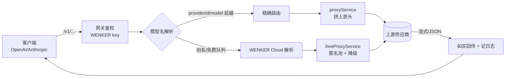

<p align="center">
  
</p>

<h1 align="center">WENKER Router · 开源本地 AI 网关</h1>

<p align="center">
  <strong>一个端口，统一所有 AI 工具。</strong><br/>
  自托管的 OpenAI + Anthropic 双协议网关，内置 <b>181</b> 家模型供应商、登记 <b>269</b> 个模型条目，
  网关实测对外可路由 <b>560+</b> 个模型 ID（含历史别名），开箱即用地对接 Claude Code、Cursor、Cline、OpenWebUI、Aider、Continue 等。
  <br/><i>Lưu ý: 560+ là số model ID có thể route (kể alias lịch sử), 269 là số model khai báo tĩnh. Free tier (Pollinations/DuckDuckGo) có giới hạn quota và có thể trả 402/429. P2P module hiện tại cần cập nhật dependency để chạy.</i>
</p>

<p align="center">
  
  
  
  
  
  
</p>

<p align="center">
  <a href="#这是做什么的">概览</a> ·
  <a href="#三分钟上手">上手</a> ·
  <a href="#接口一览">接口</a> ·
  <a href="#供应商大全">供应商</a> ·
  <a href="#架构与设计">架构</a> ·
  <a href="#常见问题">FAQ</a>
</p>

---

## 目录

- [这是做什么的](#这是做什么的)
- [设计哲学与诚实声明](#设计哲学与诚实声明)
- [三分钟上手](#三分钟上手)
  - [方式 A：Windows 一键](#方式-a-windows-一键)
  - [方式 B：npm 全局](#方式-bnpm-全局)
  - [方式 C：源码运行](#方式-c源码运行)
  - [方式 D：npx 免安装](#方式-dnpx-免安装)
- [控制台导览](#控制台导览)
- [接口一览](#接口一览)
  - [OpenAI 兼容](#openai-兼容端点)
  - [Anthropic 兼容](#anthropic-兼容端点)
  - [管理 API](#管理-api)
  - [鉴权与会话](#鉴权与会话)
- [供应商大全（181 家 · 含 Logo）](#供应商大全181-家--含-logo)
- [架构与设计](#架构与设计)
- [环境变量与配置](#环境变量与配置)
- [CLI 与脚本](#cli-与脚本)
- [静态站点与 404 小游戏](#静态站点与-404-小游戏)
- [测试与自检](#测试与自检)
- [故障排查](#故障排查)
- [常见问题](#常见问题)
- [致谢与鸣谢](#致谢与鸣谢)
- [许可证](#许可证)

---

## 这是做什么的

**WENKER Router** 是一个跑在你自己机器上的 AI 代理网关。它把散落在世界各地的模型供应商——从 OpenAI、Anthropic、Google 这样的旗舰大厂，到 Groq、Together、DeepInfra 这类高速云推理平台，再到中国系的 DeepSeek、Qwen、GLM、Kimi、豆包，以及完全本地化的 Ollama、LM Studio、vLLM——统一收敛到**一个 OpenAI 风格 + 一个 Anthropic 风格**的接口之下。

你在客户端里只需要配置一个 Base URL：

```
http://localhost:3600/v1
```

然后就可以用任意一个 WENKER 模型名（例如 `wenker-cloud/wenker-deepseek-r1-free`、`groq/llama-3.3-70b-versatile`、`ollama/qwen2.5-coder`）去调用背后真正的上游。切换供应商、加降级链、轮换 key、看日志——全部在浏览器控制台里完成，不用改客户端一行代码。

它**灵感**来自 OmniRouter / One API 这类聚合网关，但走的是"零依赖后端 + 本地文件存储 + 像素风界面"的轻量路线：后端只有 `express`、`cors`、`dotenv` 三个运行时依赖，配置、密钥、日志都写在本机的 JSON 文件里（默认 `~/.wenker`），删掉即清空，绝不偷偷上传任何东西。

### 它能替你解决什么

| 痛点 | WENKER 的做法 |
|---|---|
| 每个工具都要单独配 key、单独配 base url | 集中一处管理，客户端只认一个网关 |
| 免费额度动辄 429 / 402 就断供 | 智能降级链：主源挂了自动切备用源 |
| 想同时用 OpenAI 客户端和 Claude Code | 双协议：同一批模型既走 `/v1/chat/completions` 也走 `/v1/messages` |
| 不信任云端、担心隐私 | 全本地运行、本地存储，可完全离线（本地模型） |
| 供应商太多记不住 | 控制台按 8 大分类浏览，带 Logo、模型数、鉴权方式 |
| 想给多人 / 多设备分配额度 | 9 个 PIN 账号 + 每日 WENKER Cloud 限额 + 会话令牌 |

---

## 设计哲学与诚实声明

WENKER 的一条硬原则是**"不撒谎"**：网关永远如实反映上游状态，绝不用假的、模拟的内容糊弄你。具体表现为：

- **免费 tier 就是免费 tier。** `WENKER Cloud` 的匿名队列底层来自第三方免费源（`text.pollinations.ai`）。当上游额度耗尽返回 `402` 时，WENKER 会把**真实的 502/402 错误**原样抛给你，而不是编一段看似正常的回答。控制台里凡是提到"免费"的地方，都会同时标注"有额度限制"。
- **别名 ≠ 真身。** 一些 `wenker-*-free` 模型是**友好别名**，你请求的是 `deepseek-r1`，但匿名池当下可能只提供 `openai-fast`。真正回复你的模型会写在**日志页的 `resolvedModel` 列**里，一目了然，绝不含糊。
- **需要 key 的就是需要 key。** 想要稳定用上某个具名模型（比如真正的 DeepSeek / Qwen / Llama），请在「供应商」页填入该上游自己的 API key。WENKER 不会、也无法凭空变出付费额度。
- **本地优先，云端可选。** 所有敏感数据（密钥、日志、配置）留在本机；只有当你显式调用某个云端供应商时，请求才会发往该供应商的官方端点。

> 本项目与文中提到的任何商标持有人无隶属关系。供应商 Logo 仅用于**指代与致谢**，版权归各自所有者。

---

## 三分钟上手

前置要求只有一个：**Node.js ≥ 18**（需要原生 `fetch`）。用 `node -v` 确认版本。

### 方式 A：Windows 一键

把仓库克隆下来，双击根目录的 **`start.bat`**。它会安装依赖（如果还没装）、启动后端，并自动打开浏览器到 `http://localhost:3600`。适合完全不想碰命令行的人。

### 方式 B：npm 全局

```bash
npm install -g wenker-router
wenker
```

`wenker` 命令由 `bin/wenker.js` 提供，等价于启动 `server/index.js`。全局安装后，控制台仍在本机的 3600 端口，数据仍落在 `~/.wenker`。

### 方式 C：源码运行

```bash
git clone https://github.com/WENKER-AI/wenker-router.git
cd wenker-router
npm install
npm start
```

如果要改前端（`client/`）：

```bash
npm run install:all      # 一次性装齐 root + client 依赖
npm run dev:client       # Vite 热更新开发前端
npm run build:client     # 产出 client/dist 供后端托管
```

### 方式 D：npx 免安装

```bash
npx wenker-router
```

启动成功后终端会打印一张 banner，包含 OpenAI / Anthropic 两个 Base URL、Master Admin Key、Free Playground Key，以及当前生效的免费源说明。**请把 banner 当作权威来源**——它反映的是这台机器此刻真实的运行配置。

---

## 控制台导览

打开 `http://localhost:3600`，先用 1–9 的数字口令登录（每个数字是一个独立用户，各自有每日额度）。左侧/顶部标签页：

| 标签 | 作用 |
|---|---|
| **Dashboard 仪表盘** | 实时统计：供应商数、在线数、免费源、总请求数、今日 token、额度进度 |
| **Playground 试验场** | 内置聊天界面，支持 SSE 流式、Markdown 代码块、延迟(ms)、token 用量 |
| **Providers 供应商** | 181 家全列表，逐个开关、填 key、测活(ping)、看模型清单 |
| **Routing 路由** | 编辑降级链：主源失败后依次尝试哪些备用源 |
| **Keys 密钥** | 管理 WENKER 对外发放的 key（含 admin / playground 角色） |
| **Logs 日志** | 每条请求的耗时、上游、`resolvedModel`、状态码、错误提示 |
| **Model Finder 找模型** | 按名字/能力检索全部可用模型，一键送进 Playground |
| **Add-ons 扩展** | 安装主题/扩展，为控制台换肤（含像素皮肤） |
| **Settings 设置** | 端口、host、限额、系统提示词等全局项 |

界面主题走统一的"像素鱼"设计语言（详见[静态站点](#静态站点与-404-小游戏)一节）：方正的描边、硬投影、蓝绿渐变高亮、点阵网格背景。

---

## 接口一览

所有对外模型调用都挂在 `/v1` 前缀下。以下端点由 `server/routes/openai.js`、`server/routes/anthropic.js` 提供。

### OpenAI 兼容端点

| 方法 | 路径 | 说明 |
|---|---|---|
| `GET` | `/v1/models` | 列出当前可用模型（含所有已启用供应商） |
| `POST` | `/v1/chat/completions` | 标准对话补全，支持流式 `stream:true` |
| `POST` | `/v1/embeddings` | 向量化嵌入 |

在任意 OpenAI SDK 里把 `base_url` 指到 `http://localhost:3600/v1` 即可无缝替换。

### Anthropic 兼容端点

| 方法 | 路径 | 说明 |
|---|---|---|
| `POST` | `/v1/messages` | Claude 消息接口，供 Claude Code CLI / Cline 直连 |

请求里带上 `x-api-key`（你的 WENKER key）即可。未识别的 `/v1/*` 路径会返回**规整的 OpenAI 风格 JSON 错误**，而不是裸 HTML 堆栈。

### 管理 API

管理侧接口挂在 `/api` 下，由 `server/routes/admin.js` 提供（节选，均为**本机/授权**可访问）：

| 方法 | 路径 | 说明 |
|---|---|---|
| `GET` | `/api/stats` | 仪表盘聚合统计 |
| `GET` / `POST` | `/api/providers` | 读取 / 更新供应商配置 |
| `POST` | `/api/providers/:id/ping` | 对单个供应商做连通性探测 |
| `GET` / `POST` | `/api/keys` | 管理发放的 key |
| `GET` / `POST` | `/api/routing` | 读写降级路由规则 |
| `GET` | `/api/logs` | 拉取请求日志 |
| `GET` / `POST` | `/api/settings` | 全局设置 |
| `GET` / `POST` | `/api/addons` | 扩展安装/卸载 |
| `GET` / `POST` | `/api/downloads` | 下载位点管理 |
| `GET` | `/health` | 存活探针（无需鉴权） |

### 鉴权与会话

`/api/*` 有一个**管理护栏**，理解它很重要：

- 网关默认绑定 `0.0.0.0`，因此管理接口**只信任来自本机的回环地址**（`127.0.0.1` / `::1`）。这样你本机的控制台零配置可用。
- 任何从**真实网卡**进来的 `/api` 请求，都必须出示凭证之一：
  1. 应用登录后的会话头 `x-wenker-session: <token>`；或
  2. 管理员密钥头 `x-wenker-admin-key: <key>`（或 `Authorization: Bearer <key>`）。
- 想让本机也强制走 key，设 `WENKER_ADMIN_OPEN_LOCALHOST=0`。
- `/v1/*` **不受此护栏影响**——外部客户端（Cursor、Claude Code、VS Code 插件）继续用它们自己的 WENKER key 正常调用。

登录相关（在护栏白名单内，供登录门使用）：`/api/auth/pins`、`/api/auth/login`、`/api/auth/logout`、`/api/auth/session`、`/api/auth/quota`、`/api/auth/quota/ad-credit`。

---

## 供应商大全（181 家 · 含 Logo）

下表由 `server/config/providers-data.js` 自动汇总，按 **8 大分类**列出全部内置供应商：每行的图标是对应官网的 favicon（仅作指代与致谢，版权归各自所有者），并给出该供应商的**登记模型条目数**与**鉴权方式**（`免密 No-key` 表示匿名可用，但仍受上游额度限制）。

> 口径说明：本表"模型数"合计为 **269**，是 `providers-data.js` 里**显式登记**的条目；而网关对外 `/v1/models` 实测可路由 **560+** 个 ID——因为除登记表外，WENKER 还会展开各家上游的默认模型集与大量历史别名（如 `gpt-4o`、`claude-3-5-sonnet` 等）。两者都对，只是统计口径不同：一个数"写死的条目"，一个数"实际能调的 ID"。


### WENKER 官方内置 — 3 家

|  | 名称 | 模型数 | 鉴权 | 官网 |
|---|---|---:|---|---|
|  | WENKER Cloud (Original) | 7 | 免密 No-key | [wenker.ai](https://wenker.ai) |
|  | WENKER Community Shared Node | 1 | 免密 No-key | [text.pollinations.ai](https://text.pollinations.ai) |
|  | WENKER VIP High Speed | 2 | 免密 No-key | [wenker.ai](https://wenker.ai) |

### 免鉴权免费源 (No-Auth Free) — 8 家

|  | 名称 | 模型数 | 鉴权 | 官网 |
|---|---|---:|---|---|
|  | Blackbox AI | 1 | 免密 No-key | [www.blackbox.ai](https://www.blackbox.ai) |
|  | Cloudflare Workers AI | 3 | bearer | [developers.cloudflare.com](https://developers.cloudflare.com/workers-ai) |
|  | Cohere Trial Key | 2 | bearer | [cohere.com](https://cohere.com) |
|  | DuckDuckGo AI | 4 | 免密 No-key | [duckduckgo.com](https://duckduckgo.com/chat) |
|  | Groq Free Tier | 3 | bearer | [console.groq.com](https://console.groq.com) |
|  | HuggingChat Free Tier | 3 | 免密 No-key | [huggingface.co](https://huggingface.co/chat) |
|  | Pollinations AI | 4 | 免密 No-key | [pollinations.ai](https://pollinations.ai) |
|  | Puter AI Gateway | 2 | 免密 No-key | [puter.com](https://puter.com) |

### 旗舰大厂 (Flagship) — 9 家

|  | 名称 | 模型数 | 鉴权 | 官网 |
|---|---|---:|---|---|
|  | Anthropic Claude | 4 | api-key | [console.anthropic.com](https://console.anthropic.com) |
|  | AWS Bedrock | 2 | custom-header | [aws.amazon.com](https://aws.amazon.com/bedrock) |
|  | GitHub Models | 3 | bearer | [github.com](https://github.com/marketplace/models) |
|  | Google Cloud Vertex AI | 2 | bearer | [cloud.google.com](https://cloud.google.com/vertex-ai) |
|  | Google Gemini AI Studio | 4 | bearer | [aistudio.google.com](https://aistudio.google.com) |
|  | Microsoft Azure OpenAI | 2 | api-key | [azure.microsoft.com](https://azure.microsoft.com/en-us/products/ai-services/openai-service) |
|  | OpenAI | 6 | bearer | [platform.openai.com](https://platform.openai.com) |
|  | OpenAI Sora Video Preview | 1 | bearer | [api.openai.com](https://api.openai.com/v1/sora) |
|  | xAI (Grok) | 3 | bearer | [x.ai](https://x.ai/api) |

### 云推理与网关 (Cloud Inference) — 47 家

|  | 名称 | 模型数 | 鉴权 | 官网 |
|---|---|---:|---|---|
|  | AI Sandbox Proxy | 1 | bearer | [api.sandbox.ai](https://api.sandbox.ai/v1) |
|  | AiHubMix Gateway | 1 | bearer | [aihubmix.com](https://aihubmix.com) |
|  | AIML API | 2 | bearer | [aimlapi.com](https://aimlapi.com) |
|  | Anyscale Endpoints | 1 | bearer | [anyscale.com](https://anyscale.com) |
|  | Baseten | 1 | api-key | [baseten.co](https://baseten.co) |
|  | Cerebras Inference | 2 | bearer | [cerebras.ai](https://cerebras.ai) |
|  | Clarifai Platform | 1 | api-key | [clarifai.com](https://clarifai.com) |
|  | Cloudflare Worker Proxy | 1 | 免密 No-key | [my-proxy.workers.dev](https://my-proxy.workers.dev/v1) |
|  | Convex Reactive AI Node | 1 | bearer | [{deployment_name}.convex.cloud](https://{DEPLOYMENT_NAME}.convex.cloud/api/v1) |
|  | CoreWeave Cloud Serving | 1 | bearer | [inference.coreweave.com](https://inference.coreweave.com/v1) |
|  | Crusoe Cloud Inference | 1 | bearer | [api.crusoecloud.com](https://api.crusoecloud.com/v1) |
|  | DeepInfra | 2 | bearer | [deepinfra.com](https://deepinfra.com) |
|  | Featherless AI | 1 | bearer | [featherless.ai](https://featherless.ai) |
|  | Fireworks AI | 2 | bearer | [fireworks.ai](https://fireworks.ai) |
|  | FluidStack AI Compute | 1 | bearer | [api.fluidstack.io](https://api.fluidstack.io/v1) |
|  | Fly.io GPU Inference Node | 1 | bearer | [fly-ai.fly.dev](https://fly-ai.fly.dev/v1) |
|  | FriendliAI | 1 | bearer | [friendli.ai](https://friendli.ai) |
|  | Groq Cloud | 3 | bearer | [console.groq.com](https://console.groq.com) |
|  | Helicone AI Gateway | 1 | bearer | [helicone.ai](https://helicone.ai) |
|  | Hugging Face Dedicated Endpoints | 1 | bearer | [{endpoint}.endpoints.huggingface.cloud](https://{ENDPOINT}.endpoints.huggingface.cloud/v1) |
|  | Hugging Face Inference | 2 | bearer | [huggingface.co](https://huggingface.co) |
|  | Hyperbolic | 2 | bearer | [hyperbolic.xyz](https://hyperbolic.xyz) |
|  | Kluster.ai | 1 | bearer | [kluster.ai](https://kluster.ai) |
|  | Lambda Labs Cloud GPU | 1 | bearer | [cloud.lambdalabs.com](https://cloud.lambdalabs.com/api/v1) |
|  | Lamini AI | 1 | bearer | [lamini.ai](https://lamini.ai) |
|  | Lepton AI | 2 | bearer | [lepton.ai](https://lepton.ai) |
|  | Lunary AI Proxy | 1 | bearer | [lunary.ai](https://lunary.ai) |
|  | Massed Compute FastLLM | 1 | bearer | [api.massedcompute.com](https://api.massedcompute.com/v1) |
|  | Modal Labs | 1 | bearer | [modal.com](https://modal.com) |
|  | MonsterAPI | 1 | bearer | [monsterapi.ai](https://monsterapi.ai) |
|  | MosaicML MPT Inference | 1 | bearer | [models.hosted-on.mosaicml.com](https://models.hosted-on.mosaicml.com/v1) |
|  | NanoGPT Pay-as-you-go | 1 | bearer | [nano-gpt.com](https://nano-gpt.com) |
|  | Netlify Edge Functions AI | 1 | bearer | [api.netlify.com](https://api.netlify.com/ai/v1) |
|  | Novita AI | 2 | bearer | [novita.ai](https://novita.ai) |
|  | NVIDIA NIM Microservices | 2 | bearer | [build.nvidia.com](https://build.nvidia.com) |
|  | OpenRouter | 4 | bearer | [openrouter.ai](https://openrouter.ai) |
|  | Portkey AI Gateway | 1 | api-key | [portkey.ai](https://portkey.ai) |
|  | Predibase | 1 | bearer | [predibase.com](https://predibase.com) |
|  | Railway AI Container | 1 | bearer | [railway.app](https://railway.app/api/v1) |
|  | Render Cloud LLM Proxy | 1 | bearer | [render-ai.onrender.com](https://render-ai.onrender.com/v1) |
|  | Replicate | 2 | bearer | [replicate.com](https://replicate.com) |
|  | RunPod Serverless | 1 | bearer | [runpod.io](https://runpod.io) |
|  | SambaNova Cloud | 3 | bearer | [cloud.sambanova.ai](https://cloud.sambanova.ai) |
|  | Supabase Edge Runtime AI | 1 | bearer | [{project_ref}.supabase.co](https://{PROJECT_REF}.supabase.co/functions/v1/ai) |
|  | TensorDock Serverless | 1 | bearer | [api.tensordock.com](https://api.tensordock.com/v1) |
|  | Together AI | 3 | bearer | [together.ai](https://together.ai) |
|  | Vercel AI SDK Gateway | 1 | bearer | [api.vercel.ai](https://api.vercel.ai/v1) |

### 中国 / 亚洲模型 (China) — 21 家

|  | 名称 | 模型数 | 鉴权 | 官网 |
|---|---|---:|---|---|
|  | 01.AI (零一万物 Yi) | 2 | bearer | [platform.01.ai](https://platform.01.ai) |
|  | Alibaba DashScope (Qwen / 通义千问) | 4 | bearer | [dashscope.aliyun.com](https://dashscope.aliyun.com) |
|  | Baichuan AI (百川智能) | 2 | bearer | [platform.baichuan-ai.com](https://platform.baichuan-ai.com) |
|  | Baidu Qianfan (文心一言 / ERNIE) | 2 | bearer | [cloud.baidu.com](https://cloud.baidu.com/product/wenxinworkshop) |
|  | ByteDance Doubao (火山引擎 豆包) | 2 | bearer | [www.volcengine.com](https://www.volcengine.com/product/doubao) |
|  | DeepSeek Coder Dedicated | 1 | bearer | [api.deepseek.com](https://api.deepseek.com/v1) |
|  | DeepSeek Official | 2 | bearer | [platform.deepseek.com](https://platform.deepseek.com) |
|  | Doubao Voice Synthesis API | 1 | bearer | [openspeech.bytedance.com](https://openspeech.bytedance.com/api/v1/tts) |
|  | iFlytek Spark (讯飞星火) | 2 | bearer | [xinghuo.xfyun.cn](https://xinghuo.xfyun.cn) |
|  | iFlytek Spark Desk Pro | 1 | bearer | [spark-api-open.xf-yun.com](https://spark-api-open.xf-yun.com/v1) |
|  | Kuaishou Kling AI (快手可灵) | 1 | bearer | [api.klingai.com](https://api.klingai.com/v1) |
|  | MiniMax (稀宇科技) | 2 | bearer | [api.minimax.chat](https://api.minimax.chat) |
|  | Moonshot AI (Kimi) | 3 | bearer | [platform.moonshot.cn](https://platform.moonshot.cn) |
|  | Qwen Vision-Language Cloud | 1 | bearer | [dashscope.aliyuncs.com](https://dashscope.aliyuncs.com/compatible-mode/v1) |
|  | SenseNova Omni Multimodal | 1 | bearer | [api.sensenova.cn](https://api.sensenova.cn/v1) |
|  | SenseTime (商汤 日日新) | 1 | bearer | [platform.sensenova.cn](https://platform.sensenova.cn) |
|  | SiliconFlow (硅基流动) | 3 | bearer | [siliconflow.cn](https://siliconflow.cn) |
|  | StepFun (阶跃星辰) | 2 | bearer | [platform.stepfun.com](https://platform.stepfun.com) |
|  | Tencent Hunyuan (腾讯混元) | 2 | bearer | [cloud.tencent.com](https://cloud.tencent.com/product/hunyuan) |
|  | Zhipu AI (GLM-4 / 智谱) | 3 | bearer | [open.bigmodel.cn](https://open.bigmodel.cn) |
|  | Zhipu CogView 3 / GLM-4V | 1 | bearer | [open.bigmodel.cn](https://open.bigmodel.cn/api/paas/v4/images) |

### 编程与 Agent (Coding) — 17 家

|  | 名称 | 模型数 | 鉴权 | 官网 |
|---|---|---:|---|---|
|  | Aider AI Pair Programming | 1 | 免密 No-key | [localhost](http://localhost:8088/v1) |
|  | Augment Code Enterprise | 1 | bearer | [api.augmentcode.com](https://api.augmentcode.com/v1) |
|  | Baidu Comate Coding AI | 1 | bearer | [comate.baidu.com](https://comate.baidu.com/v1) |
|  | Claude Code Protocol | 1 | api-key | [docs.anthropic.com](https://docs.anthropic.com/en/docs/agents-and-tools/claude-code/overview) |
|  | Cline MCP Router | 1 | 免密 No-key | [localhost](http://localhost:3333/v1) |
|  | Codeium / Windsurf | 1 | bearer | [codeium.com](https://codeium.com) |
|  | CodeRabbit AI PR Review | 1 | bearer | [api.coderabbit.ai](https://api.coderabbit.ai/v1) |
|  | Continue.dev Bridge | 1 | 免密 No-key | [localhost](http://localhost:65432/v1) |
|  | Cursor Tab Proxy | 1 | 免密 No-key | [localhost](http://localhost:3001/v1) |
|  | Greptile Codebase Knowledge | 1 | bearer | [api.greptile.com](https://api.greptile.com/v2) |
|  | Magic.dev LTM-2-mini | 1 | bearer | [api.magic.dev](https://api.magic.dev/v1) |
|  | OpenHands (All-Hands AI) | 1 | 免密 No-key | [github.com](https://github.com/All-Hands-AI/OpenHands) |
|  | Phind AI Search | 1 | 免密 No-key | [phind.com](https://phind.com) |
|  | Poolside AI Coding | 1 | bearer | [api.poolside.ai](https://api.poolside.ai/v1) |
|  | Replit Agent Proxy | 1 | bearer | [replit.com](https://replit.com) |
|  | Replit Ghostwriter Fast | 1 | bearer | [replit.com](https://replit.com/api/ghostwriter) |
|  | Sourcegraph Cody | 1 | bearer | [sourcegraph.com](https://sourcegraph.com/cody) |

### 本地运行时 (Local Runtimes) — 30 家

|  | 名称 | 模型数 | 鉴权 | 官网 |
|---|---|---:|---|---|
|  | Aphrodite Engine | 1 | 免密 No-key | [github.com](https://github.com/PygmalionAI/aphrodite-engine) |
|  | AudioCraft MusicGen Local | 1 | 免密 No-key | [localhost](http://localhost:8000/music) |
|  | Boba Local Gateway | 1 | 免密 No-key | [localhost](http://localhost:4040/v1) |
|  | Chrome Gemini Nano Local | 1 | 免密 No-key | [localhost](http://localhost:9999/v1) |
|  | ComfyUI Node API | 1 | 免密 No-key | [localhost](http://localhost:8188) |
|  | Coqui TTS XTTS-v2 Local | 1 | 免密 No-key | [localhost](http://localhost:5002/api/tts) |
|  | FastChat OpenAI Compatible | 1 | 免密 No-key | [github.com](https://github.com/lm-sys/FastChat) |
|  | Faster-Whisper Local Server | 1 | 免密 No-key | [localhost](http://localhost:8000/v1/audio/transcriptions) |
|  | Jan.ai Local | 1 | 免密 No-key | [jan.ai](https://jan.ai) |
|  | KoboldCpp | 1 | 免密 No-key | [github.com](https://github.com/LostRuins/koboldcpp) |
|  | LibreChat Gateway | 1 | 免密 No-key | [librechat.ai](https://librechat.ai) |
|  | llama.cpp Server | 1 | 免密 No-key | [github.com](https://github.com/ggerganov/llama.cpp) |
|  | LM Studio Local | 1 | 免密 No-key | [lmstudio.ai](https://lmstudio.ai) |
|  | LocalAI | 1 | 免密 No-key | [localai.io](https://localai.io) |
|  | Meta Llama Stack | 1 | 免密 No-key | [localhost](http://localhost:5000/v1) |
|  | NextChat Proxy | 1 | bearer | [localhost](http://localhost:3000/api/openai) |
|  | NVIDIA Triton Server | 1 | 免密 No-key | [developer.nvidia.com](https://developer.nvidia.com/triton-inference-server) |
|  | Ollama Local | 4 | 免密 No-key | [ollama.com](https://ollama.com) |
|  | Oobabooga TextGen | 1 | 免密 No-key | [github.com](https://github.com/oobabooga/text-generation-webui) |
|  | OpenLLM BentoML | 1 | 免密 No-key | [github.com](https://github.com/bentoml/OpenLLM) |
|  | OpenWebUI Backend | 1 | 免密 No-key | [openwebui.com](https://openwebui.com) |
|  | SD WebUI A1111 | 1 | 免密 No-key | [localhost](http://localhost:7860/sdapi/v1) |
|  | SGLang Server | 1 | 免密 No-key | [github.com](https://github.com/sgl-project/sglang) |
|  | Suno Bark Audio Local | 1 | 免密 No-key | [localhost](http://localhost:8000/audio) |
|  | Tabby Coding ML | 1 | 免密 No-key | [tabby.tabbyml.com](https://tabby.tabbyml.com) |
|  | Text Generation Inference (TGI) | 1 | 免密 No-key | [github.com](https://github.com/huggingface/text-generation-inference) |
|  | Vast.ai GPU Instance Proxy | 1 | 免密 No-key | [localhost](http://localhost:18000/v1) |
|  | vLLM Engine | 1 | 免密 No-key | [github.com](https://github.com/vllm-project/vllm) |
|  | WebLLM WebGPU Browser | 1 | 免密 No-key | [localhost](http://localhost:8081/v1) |
|  | Xorbits Inference | 1 | 免密 No-key | [github.com](https://github.com/xorbitsai/inference) |

### 专项能力 (Specialized) — 46 家

|  | 名称 | 模型数 | 鉴权 | 官网 |
|---|---|---:|---|---|
|  | Agenta Prompt Hub | 1 | 免密 No-key | [localhost](http://localhost:80/api) |
|  | AI21 Labs | 2 | bearer | [ai21.com](https://ai21.com) |
|  | Aleph Alpha | 1 | bearer | [aleph-alpha.com](https://aleph-alpha.com) |
|  | Arize Phoenix Tracing | 1 | 免密 No-key | [localhost](http://localhost:6006/v1) |
|  | AssemblyAI Conformer-2 | 1 | bearer | [api.assemblyai.com](https://api.assemblyai.com/v2) |
|  | BAAI BGE Embeddings | 1 | 免密 No-key | [localhost](http://localhost:8000/v1/embeddings) |
|  | Black Forest Labs FLUX.1 | 1 | bearer | [api.bfl.ml](https://api.bfl.ml/v1) |
|  | Brave Search Summarizer | 1 | bearer | [api.search.brave.com](https://api.search.brave.com/res/v1) |
|  | Cartesia Sonic Ultra Fast TTS | 1 | api-key | [api.cartesia.ai](https://api.cartesia.ai) |
|  | Chainlit Literal AI | 1 | bearer | [cloud.literalai.com](https://cloud.literalai.com/api) |
|  | Cohere Platform | 2 | bearer | [cohere.com](https://cohere.com) |
|  | Cohere Rerank v3 | 1 | bearer | [api.cohere.com](https://api.cohere.com/v2/rerank) |
|  | Databricks Model Serving | 1 | bearer | [www.databricks.com](https://www.databricks.com/product/model-serving) |
|  | Deepgram Nova Speech-to-Text | 1 | bearer | [api.deepgram.com](https://api.deepgram.com/v1) |
|  | Dify.ai Engine | 1 | 免密 No-key | [dify.ai](https://dify.ai) |
|  | ElevenLabs Voice AI | 1 | api-key | [api.elevenlabs.io](https://api.elevenlabs.io/v1) |
|  | Exa.ai Neural Search | 1 | api-key | [exa.ai](https://exa.ai) |
|  | Firecrawl AI Web Scraper | 1 | bearer | [firecrawl.dev](https://firecrawl.dev) |
|  | Guardrails AI Validator | 1 | 免密 No-key | [localhost](http://localhost:8000/guards) |
|  | IBM watsonx.ai | 1 | bearer | [www.ibm.com](https://www.ibm.com/watsonx) |
|  | Ideogram Typography AI | 1 | api-key | [api.ideogram.ai](https://api.ideogram.ai) |
|  | Jina AI | 2 | bearer | [jina.ai](https://jina.ai) |
|  | Langfuse LLM Observability | 1 | bearer | [cloud.langfuse.com](https://cloud.langfuse.com/api/public) |
|  | Llama Guard Safety Node | 1 | 免密 No-key | [localhost](http://localhost:8000/v1/chat/completions) |
|  | Luma AI Dream Machine (Video) | 1 | bearer | [api.lumalabs.ai](https://api.lumalabs.ai/dream-machine/v1) |
|  | Mem0 Personalized Memory | 1 | bearer | [api.mem0.ai](https://api.mem0.ai/v1) |
|  | Midjourney Discord Proxy | 1 | bearer | [localhost](http://localhost:8080/mj) |
|  | Mistral AI | 4 | bearer | [mistral.ai](https://mistral.ai) |
|  | Mistral Embeddings | 1 | bearer | [api.mistral.ai](https://api.mistral.ai/v1/embeddings) |
|  | Neets.ai TTS API | 1 | bearer | [api.neets.ai](https://api.neets.ai/v1) |
|  | Nomic AI | 1 | bearer | [nomic.ai](https://nomic.ai) |
|  | Oracle Cloud OCI Generative AI | 1 | bearer | [www.oracle.com](https://www.oracle.com/artificial-intelligence/generative-ai/service/) |
|  | Perplexity AI | 3 | bearer | [perplexity.ai](https://perplexity.ai) |
|  | Promptfoo Local Evaluation | 1 | 免密 No-key | [localhost](http://localhost:15500/v1) |
|  | Runway Gen-3 Alpha Video | 1 | bearer | [api.runwayml.com](https://api.runwayml.com/v1) |
|  | Serper Google Search AI | 1 | api-key | [google.serper.dev](https://google.serper.dev) |
|  | Snowflake Cortex AI | 1 | bearer | [docs.snowflake.com](https://docs.snowflake.com/en/user-guide/snowflake-cortex/llm-functions) |
|  | Speechmatics Realtime STT | 1 | bearer | [asr.api.speechmatics.com](https://asr.api.speechmatics.com/v2) |
|  | Supermemory AI Brain | 1 | bearer | [api.supermemory.ai](https://api.supermemory.ai/v1) |
|  | Tavily AI Search | 1 | bearer | [tavily.com](https://tavily.com) |
|  | Traceloop OpenLLMetry | 1 | bearer | [api.traceloop.com](https://api.traceloop.com/v1) |
|  | Unsloth AI Studio | 1 | 免密 No-key | [unsloth.ai](https://unsloth.ai) |
|  | Upstage Solar | 1 | bearer | [upstage.ai](https://upstage.ai) |
|  | Voyage AI | 2 | bearer | [voyageai.com](https://voyageai.com) |
|  | Voyage Multimodal 3 | 1 | bearer | [api.voyageai.com](https://api.voyageai.com/v1/multimodal) |
|  | You.com Express Search | 1 | bearer | [api.ydc-index.io](https://api.ydc-index.io/search) |

---

## 架构与设计

```
wenker-router/
├── bin/wenker.js            # 全局 CLI 入口
├── server/
│   ├── index.js             # Express 装配：CORS、body、护栏、路由、静态、404、错误中枢
│   ├── config/
│   │   └── providers-data.js# 181 家供应商的声明式配置（Base URL/鉴权/模型/分类）
│   ├── routes/
│   │   ├── openai.js        # /v1/chat/completions · /v1/models · /v1/embeddings
│   │   ├── anthropic.js     # /v1/messages
│   │   ├── admin.js         # /api/* 管理面
│   │   └── auth.js          # /api/auth/* 登录/会话/额度
│   └── services/
│       ├── dbService.js     # 本地 JSON 文件持久化（~/.wenker）
│       ├── proxyService.js  # 上游转发、鉴权头拼装、流式透传
│       └── freeProxyService.js # 免费源/匿名池与降级
├── client/                  # React + Vite + Tailwind 控制台（构建到 client/dist）
├── web/                     # 纯静态营销站 + 404 小游戏（挂 /web）
├── system-prompts/          # 可选的系统提示词素材
├── data/                    # 仓库内的初始/示例数据
├── scripts/                 # 自检、探针、迁移、i18n 校验等工具脚本
├── start.bat                # Windows 一键启动
└── package.json
```

一次请求的生命周期（概念图，非源码）：



几个关键设计点：

- **声明式供应商。** 新增一家供应商基本只是在配置数组里加一条：`id / name / category / baseUrl / authType / headerName / requiresAuth / models[]`。路由、鉴权、测活逻辑都是通用的，无需改核心代码。
- **文件即数据库。** `dbService` 把配置、密钥、日志、路由规则、自定义供应商分别落成 JSON 文件，全部在 `WENKER_HOME`（默认 `~/.wenker`）下。想备份就拷目录，想重置就删目录。
- **降级链可编排。** 「路由」页里给某类请求配一串候选源；主源 429/超时/额度耗尽时按序尝试，最终失败则如实报错并写进日志。
- **流式优先。** SSE 逐 token 透传，尽量不缓冲，保留首字延迟(TTFT)与真实中断行为。

> 出于对项目核心的尊重，本文档**不粘贴**路由/降级/密钥处理的具体实现代码。想读实现请直接看 `server/` 源码——它很短、很好读。

---

## 环境变量与配置

| 变量 | 默认 | 作用 |
|---|---|---|
| `PORT` | `3600` | 监听端口（也可在设置页改，存于配置） |
| `HOST` | `0.0.0.0` | 绑定地址；只想本机访问就设 `127.0.0.1` |
| `WENKER_HOME` | `~/.wenker` | 数据目录（配置/密钥/日志/自定义源） |
| `WENKER_ADMIN_OPEN_LOCALHOST` | `1` | 设 `0` 则本机调用 `/api` 也需 admin key |

配置优先级：环境变量 > 设置页存下的值 > 代码默认。示例配置文件在仓库 `data/` 下，首次运行会引导到 `WENKER_HOME`。

---

## CLI 与脚本

- **`wenker`**（`bin/wenker.js`）：全局命令，启动网关。
- **`npm start` / `npm run dev`**：直接跑 `server/index.js`。
- **`npm run build:client`**：构建 React 控制台到 `client/dist`。
- **`npm run dev:client`**：Vite 开发服务器。
- **`npm run web`**：起零依赖静态服务器预览 `web/`（默认 4173）。
- **`npm run pack:dry`**：预览发布包内容（`files` 白名单见 `package.json`）。

`scripts/` 目录还有一批**自检与探针**脚本（如 `check-i18n.js`、`check-models.js`、`check-404.js`、各类 `*-proof.js` / `verify-*.js` / `test-*.js`），用于验证 i18n 覆盖、模型可用性、免费源实况、路由与降级行为等。它们大多是一次性/诊断脚本，可按需运行。

---

## 静态站点与 404 小游戏

除了登录后的控制台，仓库还带一个**纯静态营销/文档站**（`web/`），无需构建、无 CDN、无埋点，可直接用 `file://` 打开，也可由后端挂载在 **`/wenker`**：

- `http://localhost:3600/wenker/` —— 介绍 / 特性 / 安装 / 文档 / 生态 / 仓库 / 致谢。
- 全站**四语**：越南语、英语、中文、法语，右上角一键切换，选择记在 `localStorage`。
- 图标全部是**手绘点阵 SVG**（不是 emoji），与"像素鱼"配色一致。
- 标签页采用类 Mistral 的**滑动下划线指示器**动画。

访问一个不存在的链接会进入 **404 页**（`web/404.html`，后端对未知页面路径也会返回它），标题是那句俏皮话：

> **Ốc. 有东西不太对劲……**（"糟了，这里出了点问题"）

页面下嵌了三个可玩的像素小游戏，共用一块 canvas：

| 游戏 | 玩法 | 操作 |
|---|---|---|
| 贪吃蛇 Rắn | 吃点变长，撞墙/撞自己结束 | 方向键 / WASD |
| 接小鱼 Bắt cá | 移动篮子接住掉落的鱼，漏 3 条结束 | 左右键 / 拖动 |
| 飞天鲸 Cá voi bay | Flappy 式，穿过管道缝隙 | 空格跳跃 / 点击 |

游戏用 `requestAnimationFrame` + 固定步长累加器驱动，切到后台标签会自动暂停，尊重 `prefers-reduced-motion`。

---

## 测试与自检

推荐在改动后跑一遍：

```bash
node --check server/index.js          # 语法自检
node scripts/check-i18n.js            # 四语字典键对齐 + HTML 覆盖
node scripts/check-models.js          # 模型清单一致性
node scripts/check-404.js             # 404 页资源/挂载校验
npm run build:client                  # 前端构建不报错
```

`e2e-test.mjs` 提供端到端冒烟；各类 `verify-cloud-live.js` / `test-failover-rescue.js` 会真实打上游，请在有网且理解额度消耗的前提下谨慎运行。

---

## 故障排查

| 症状 | 多半原因 | 处理 |
|---|---|---|
| 端口被占用、起不来 | 3600 已被别的进程占 | 改 `PORT` 或杀掉占用进程 |
| 免费模型回复 402/502 | 匿名上游额度耗尽（真实错误） | 在「供应商」页为该上游填 key，或换付费源 |
| 请求 401（本机却失败） | 设了 `WENKER_ADMIN_OPEN_LOCALHOST=0` 却没带 key | 出示 admin key 或改回默认 |
| 远程打不开控制台 | `/api` 护栏要求凭证 | 用登录会话头或 admin key |
| 中文/越南文乱码 | 字体缺字重 | 界面已带回退字体栈，一般无需处理 |
| 改了前端没生效 | 没重新构建 | `npm run build:client` 后强刷 |

---

## 常见问题

**Q：它会不会把我的 key 上传到云端？**
A：不会。密钥与配置只写在本机 `WENKER_HOME` 的 JSON 文件里。只有你主动调用某个云端供应商时，请求才会带该供应商的 key 发往它的官方端点。

**Q：Free Playground 真的完全不要 key 吗？**
A：匿名免费队列确实不需要你提供 key，但它有额度上限，且上游可能随时 402。想要稳定与具名模型，请自行配置上游 key。

**Q：模型名怎么带前缀？**
A：用 `providerId/modelName`（如 `groq/llama-3.3-70b-versatile`、`wenker-cloud/wenker-deepseek-r1-free`）可 100% 精确路由到你想要的那家；不带前缀则走默认解析/降级。

**Q：能同时给 OpenAI 客户端和 Claude Code 用吗？**
A：能。同一批模型既暴露在 `/v1/chat/completions`（OpenAI）也暴露在 `/v1/messages`（Anthropic）。

**Q：想清空重来？**
A：删掉 `WENKER_HOME` 目录即可（示例数据在 `data/`，下次运行会重新引导）。

**Q：支持 Docker 吗？**
A：本质就是一个 Node 进程 + 一个数据目录，容器化时把 `WENKER_HOME` 挂成卷即可。

---

## ⚠️ Hiện trạng & Hạn chế (Honest Status)

Để minh bạch cho người dùng và contributor:

| Tính năng | Trạng thái | Ghi chú |
|-----------|------------|---------|
| **SSE Streaming** | ✅ Đã hỗ trợ | `/v1/chat/completions?stream=true` hoạt động cho keyed providers. Free tier (Pollinations/DuckDuckGo) emit SSE locally từ response non-stream. |
| **P2P Network** | ⚠️ **Chưa sẵn sàng production** | Code ở `server/p2p/` nhưng dependency `@libp2p/core` v1.x không còn trên npm. Cần update lên libp2p mới (`@libp2p/interface-*`, `@libp2p/tcp`, `@libp2p/websockets`, `@chainsafe/libp2p-noise`, `@chainsafe/libp2p-yamux`, `@libp2p/mdns`, `@libp2p/floodsub` / `@libp2p/gossipsub`). |
| **Free Tier (Pollinations/DuckDuckGo)** | ⚠️ Unreliable | Thường 402/429/503. Không phù hợp production. Hãy nhập free key cho OpenRouter/Groq/Gemini/NVIDIA/SambaNova. |
| **Provider Health Check** | ✅ Manual / On-demand | Chưa có background proactive health check định kỳ. UI có nút "Ping" nhưng không tự động chạy nền. |
| **Circuit Breaker** | ✅ Đã implement (`server/services/circuitBreaker.js`) | Đã tích hợp trong `proxyService._directChat`. Configurable qua Settings. |
| **Input Sanitization** | ❌ Chưa có | Cần thêm middleware sanitize `messages.content` chống prompt injection. |
| **Plugin API Auth** | ❌ Chưa có | Endpoint `/api/plugins/*` chưa yêu cầu admin key. |
| **Metrics / Observability** | ⚠️ Partial | `prom-client` đã trong deps nhưng chưa expose `/metrics` endpoint. |
| **Test Coverage** | ~5% | Chỉ rate limiter có test. Services/routes khác chưa có unit/integration test. |

---

## 致谢与鸣谢

WENKER 站在许多开源与免费服务的肩膀上。**下列品牌/项目的商标与版权各自归其所有者所有**，此处列出仅为集成致谢：

- **上游模型与推理平台**：OpenAI、Anthropic、Google、xAI、Microsoft Azure、AWS、GitHub、Groq、Cerebras、SambaNova、Together、Fireworks、DeepInfra、Novita、Lepton、Hyperbolic、Friendli、OpenRouter、Replicate、Hugging Face、NVIDIA、MosaicML、Lambda、CoreWeave、Crusoe、FluidStack、TensorDock 等。
- **中国 / 亚洲模型**：DeepSeek、Moonshot（Kimi）、智谱 Zhipu（GLM）、阿里通义 Qwen（DashScope）、百川、MiniMax、字节豆包（火山引擎）、零一万物 Yi、阶跃星辰、百度文心/Comate、腾讯混元、商汤日日新、讯飞星火、快手可灵 等。
- **专项能力**：Mistral、Cohere、Perplexity、AI21、Aleph Alpha、Jina、Voyage、Upstage、Firecrawl、Tavily、Exa、ElevenLabs、Deepgram、AssemblyAI、Black Forest Labs（FLUX）、Midjourney、Ideogram、Luma、Runway 等。
- **本地运行时**：Ollama、LM Studio、vLLM、LocalAI、Jan、TextGen、KoboldCpp、llama.cpp、SGLang、Xinference、OpenWebUI、LibreChat、FastChat、TGI、OpenLLM、Triton 等。
- **免费 / 匿名源**：Pollinations、DuckDuckGo AI、HuggingChat、Cloudflare Workers AI、Puter、Groq Free、Cohere Trial 等。
- **编程 / Agent**：Claude Code、Cursor、Continue、Aider、Cline、OpenHands、Replit、Codeium/Windsurf、Sourcegraph Cody、Phind、CodeRabbit、Greptile、Augment、Poolside、Magic 等。
- **灵感与生态**：OmniRouter、One API 等聚合网关项目。

**特别鸣谢（贡献 / 本地化 / 反馈）：**

- 作者与维护：**arist999**
- 界面与像素素材：项目自带点阵字体与手绘 SVG 图标
- 多语言：越南语 / 英语 / 中文 / 法语 本地化
- 以及所有提交 Issue 与 PR 的社区成员 

---

## 许可证

本项目以 **MIT** 许可证开源，详见 [`LICENSE`](LICENSE)。

> © 2026 **arist999** · WENKER Router · Released under the MIT License.

<p align="center">
  <a href="https://github.com/WENKER-AI/wenker-router">GitHub</a> ·
  <a href="https://www.npmjs.com/package/wenker-router">npm</a> ·
  <a href="https://github.com/WENKER-AI/wenker-router/issues">Issues</a> ·
  <a href="http://localhost:3600">本地控制台</a>
</p>

<p align="center"><sub>Made by arist999 · 一个端口，统一所有 AI。</sub></p>
